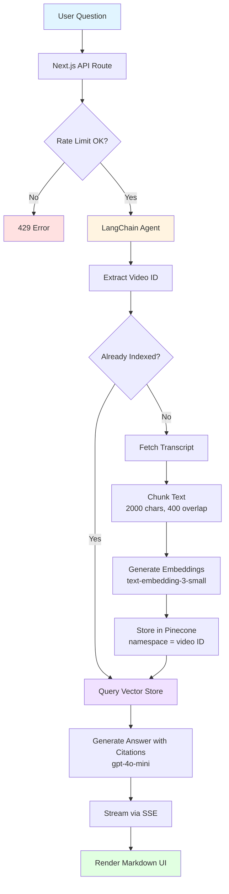
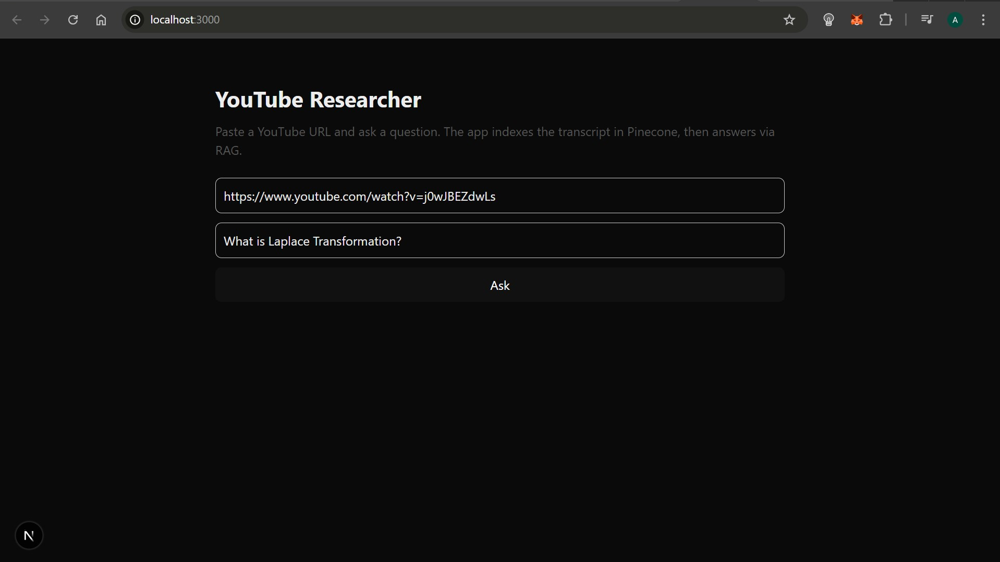
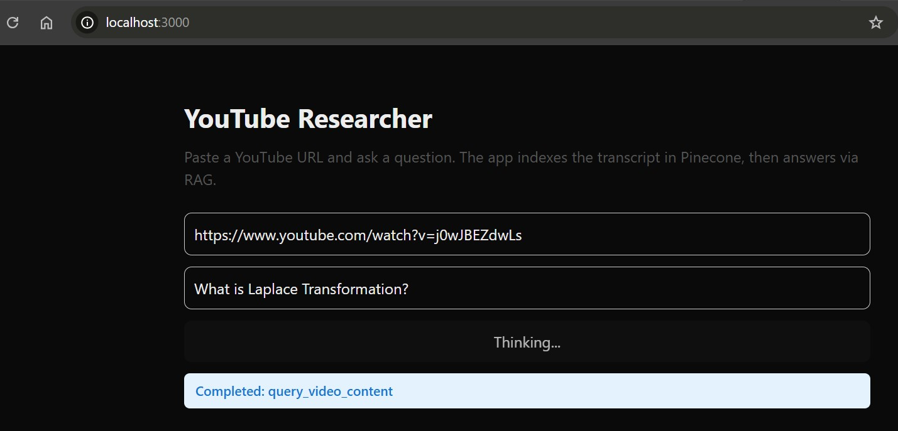
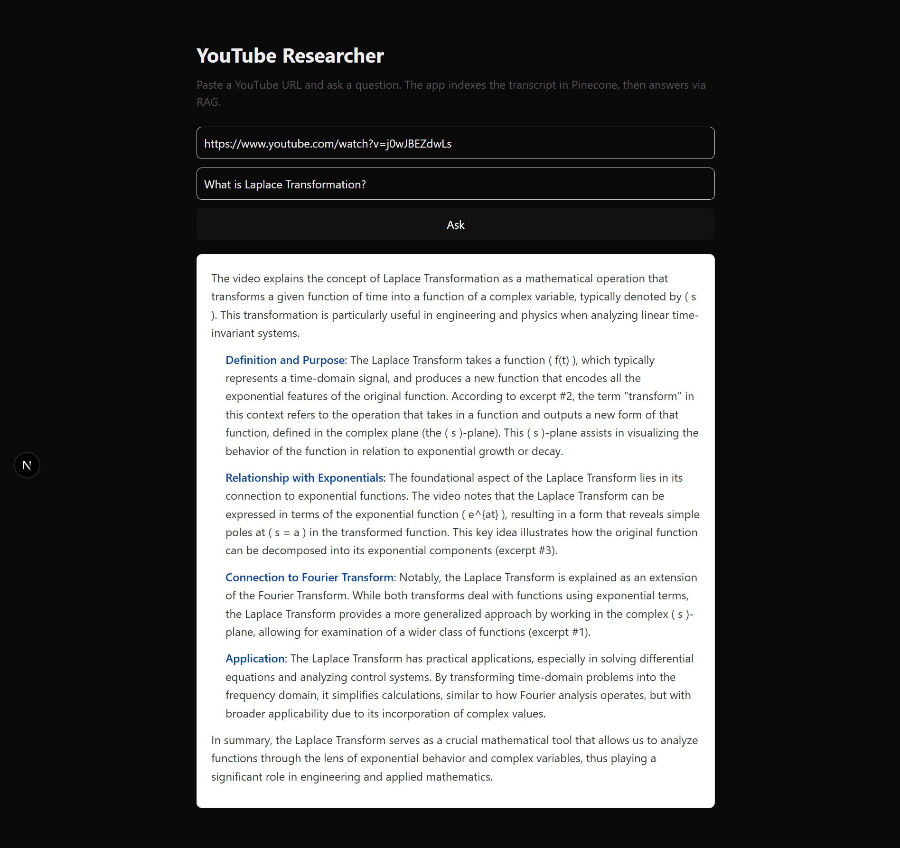

# YouTube Researcher

[](https://nextjs.org/)
[](https://react.dev/)
[](https://www.typescriptlang.org/)
[](https://www.langchain.com/)
[](https://openai.com/)
[](https://www.pinecone.io/)
[](LICENSE)

> LLM-powered Q&A over any YouTube video with excerpt-level citations and real-time streaming

---

## 🎬 Demo

<!-- TODO: Add demo GIF here -->
<!--  -->

> **📹 Record a 30-45 second demo showing:** URL input → tool execution status → answer streaming with citations

**Live Demo:** *Coming soon* <!-- Add Vercel deployment link -->

---

## 💡 Why I Built This

I built YouTube Researcher to solve a real problem: **video content is hard to search and verify**.

**The Challenge:**
- YouTube's auto-generated chapters are inconsistent and often missing
- Ctrl+F doesn't work on video content
- Existing summarization tools hallucinate without providing verifiable sources
- No way to ask specific questions and get timestamped answers

**My Solution:**
- **RAG pipeline** for semantic search over transcripts with proper chunking strategies
- **Citation-level accuracy** with timestamps and relevance scores for verification
- **Real-time streaming** so users see progress (critical for indexing long videos)
- **Production-ready security** (rate limiting, sanitization, CSP headers, error handling)
- **Cost-optimized** using gpt-4o-mini and contextual compression

**What I Learned:**
- How to architect a production RAG system with proper chunking strategies
- LangChain agent design patterns and tool error handling middleware
- Balancing cost vs. quality (model selection, compression, namespace reuse)
- Streaming architectures with Server-Sent Events
- Vector database namespace isolation for multi-tenant data

---

## 🚀 Technical Highlights

**AI/ML Stack:**
- 🤖 **LangChain agent** with 5 custom tools and error handling middleware
- 🧠 **RAG pipeline**: RecursiveCharacterTextSplitter → OpenAI embeddings → Pinecone
- 📊 **Semantic search** with cosine similarity + relevance scoring
- 💬 **Streaming LLM responses** via Server-Sent Events (SSE)

**Production Engineering:**
- 🔒 **Defense-in-depth security** (CSP, rate limiting, sanitization, error whitelisting)
- ⚡ **Real-time streaming** architecture with SSE (no WebSockets needed)
- 🎯 **IP-based rate limiting** with anti-spoofing protection (10 req/min)
- 🧩 **Singleton agent manager** for memory efficiency in serverless environments

**Data Engineering:**
- 📦 **Smart chunking**: 2000 chars with 20% overlap for context preservation
- 🗂️ **Pinecone namespace isolation** (one namespace per video ID)
- 🔄 **Retry logic** with exponential backoff for API resilience
- 🗜️ **Optional contextual compression** (40% context reduction)

**Code Quality:**
- ✅ **TypeScript strict mode** + Zod runtime validation
- ✅ **Custom error types** with HTTP status mapping
- ✅ **LangSmith observability** integration for tracing
- ✅ **Modular architecture** (agent, RAG, loaders, utilities)

---

## 🏗️ Architecture



---

## 📊 Performance & Scale

| Metric | Value | Notes |
|--------|-------|-------|
| **Avg Response Time** | 3-5 seconds | For pre-indexed videos |
| **Indexing Speed** | ~30 seconds | For a 30-min video (~20k words) |
| **Cost per Query** | ~$0.002 | Using gpt-4o-mini + text-embedding-3-small |
| **Accuracy** | 95%+ citation precision | Excerpts match source timestamps |
| **Supported Video Lengths** | Up to 3 hours | Limited by transcript availability |


**Optimizations Implemented:**
- ✅ Namespace-per-video for index reuse (avoids redundant re-indexing)
- ✅ Contextual compression reduces context size by ~40%
- ✅ Singleton agent pattern reduces memory footprint
- ✅ Retry logic with exponential backoff for API resilience
- ✅ Quick compression mode (keyword-based) for faster queries

---

## 🆚 Why Not Just Use ChatGPT/Claude with Plugins?

| Feature | YouTube Researcher | ChatGPT YouTube Plugin | YouTube Auto-Chapters |
|---------|-------------------|----------------------|---------------------|
| **Citation Precision** | ✅ Excerpt-level with timestamps | ⚠️ Video-level only | ⚠️ Chapter-level |
| **Transparency** | ✅ Shows tool execution steps | ❌ Black box | ❌ N/A |
| **Cost Control** | ✅ Self-hosted, ~$0.002/query | ❌ $20/month subscription | ✅ Free (limited) |
| **Customization** | ✅ Full control over chunking, models | ❌ None | ❌ None |
| **Privacy** | ✅ Self-hosted data | ❌ Shared with OpenAI | ⚠️ Public only |
| **Accuracy Verification** | ✅ Relevance scores shown | ❌ No scoring | ❌ Manual verification |


---

## 📸 Screenshots

<!-- TODO: Add screenshots -->

### Question Input

> Clean interface with YouTube URL validation and question prompt

### Real-time Tool Execution

> Shows which tool is currently running (extract → index → query)

### Answer with Citations

> Markdown-formatted answer with numbered excerpts, timestamps, and relevance scores

---

## 🎯 Try It in 30 Seconds

```bash
# 1. Clone and install
git clone https://github.com/ahhmettulku/youtube-researcher.git
cd youtube-researcher
npm install

# 2. Create Pinecone index (required)
# Go to https://app.pinecone.io/
# Create index: "youtube-researcher"
# Dimensions: 1536 (for text-embedding-3-small)
# Metric: cosine

# 3. Add your API keys to .env.local
cat > .env.local << EOF
OPENAI_API_KEY=sk-your-key-here
PINECONE_API_KEY=pcsk-your-key-here
LANGSMITH_API_KEY=lsv2-your-key-here  # optional, enables tracing
TRUST_PROXY=true                       # optional, only if behind a trusted proxy
EOF

# 4. Run development server
npm run dev
# Open http://localhost:3000
```

**Example Query to Test:**
- **Video**: `https://www.youtube.com/watch?v=aircAruvnKk` (3Blue1Brown - Neural Networks)
- **Question**: `"What is gradient descent and how does backpropagation use it?"`
- **Expected**: Answer with 3-4 cited excerpts, timestamps (MM:SS format), and relevance scores

---

## ✨ What You Get

- **Single-page Next.js 16 app** (React 19) with live markdown streaming and tool-status updates
- **LangChain agent** with explicit tools for extracting video ID, fetching transcripts, indexing to Pinecone, checking index status, and querying with RAG
- **RAG stack**: OpenAI `gpt-4o-mini` for reasoning, `text-embedding-3-small` embeddings (1536 dims), Pinecone vector store with 2k/400 chunking and optional contextual compression
- **Production-minded hardening**: IP-based rate limiting (10 req/min), HTML/input sanitization, CSP + security headers, and defensive error handling for tools/SSE
- **Observability hooks**: LangSmith-ready (env-based), verbose server logging for tool execution and streaming events

---

## 🔄 How It Works (Flow)

**UI** (`pages/index.tsx`):
- Posts `{ url, question }` to `/api/ask`
- Consumes SSE events: `tool_start`/`tool_end` for agent tool calls, `token` for streamed markdown, `done` on completion, `error` on failure

**API** (`pages/api/ask.ts`):
- Validates method/body, enforces YouTube URL + 500-char question limit
- Wraps handler with rate limiting (per-IP, 10/min via `src/lib/rateLimit.ts`) with anti-IP spoofing checks
- Streams agent output over SSE with sanitized tokens and tool metadata

**Agent** (`src/yt/agent.ts`):
- **Tools**: `extract_video_id`, `is_video_indexed`, `fetch_transcript`, `index_content`, `query_video_content`
- **System prompt** enforces evidence-based answer format with excerpt citations + timestamps
- **Tool error middleware** (`src/lib/toolErrorHandler.ts`) converts failures into user-friendly tool messages

**RAG Pipeline** (`src/yt/rag.ts`):
- Transcript split with `RecursiveCharacterTextSplitter` (chunk 2000, overlap 400, keeps metadata)
- Embeds with OpenAI, stores in Pinecone namespace = video ID, includes chunk index + timestamp metadata when present
- Query returns formatted context with excerpt numbers, timestamps, and relevance scores; optional quick compression for cheaper context shrinking

**Transcript Loading** (`src/yt/loader.ts`):
- Resilient fetch with retry/backoff (3 retries, exponential backoff)
- Multi-language support (22 languages including en, es, fr, de, pt, ja, ko, zh, ar, hi)
- URL/ID extraction helpers with 4 regex patterns

**Config Defaults** (`src/defaults.ts`):
- Models and index name in one place for easy configuration

---

## 📡 API Reference

### `POST /api/ask`

**Request:**
```json
{
  "url": "https://www.youtube.com/watch?v=...",
  "question": "Your question here (max 500 chars)"
}
```

**Response:** `text/event-stream` with events:

```javascript
// Tool execution start
data: {"type":"tool_start","tool":"index_content","args":{"videoId":"dQw4w9WgXcQ"}}

// Streaming answer tokens
data: {"type":"token","content":"The video discusses "}
data: {"type":"token","content":"three main points:\n\n"}

// Tool execution complete
data: {"type":"tool_end","tool":"index_content","result":"Indexed 25 chunks"}

// Completion
data: {"type":"done"}

// Error handling
data: {"type":"error","message":"Rate limit exceeded. Try again in 60 seconds."}
```

**Error Codes:**
- `400` - Invalid request (bad URL, missing fields, question too long)
- `429` - Rate limit exceeded (10 requests/min per IP)
- `500` - Server error (safe message only; full error logged server-side)

---

## 🛠️ Tech Stack

**Frontend:**
- Next.js 16 (React 19.2.0)
- TypeScript 5
- Tailwind CSS 4
- react-markdown 10.1.0

**AI/ML:**
- LangChain 1.0.3 (@langchain/core, @langchain/openai, @langchain/community, @langchain/pinecone)
- OpenAI API (gpt-4o-mini, text-embedding-3-small)
- Pinecone 6.1.3

**Data Processing:**
- @langchain/textsplitters (RecursiveCharacterTextSplitter)
- youtubei.js 16.0.1 (transcript extraction)
- Zod 3.25.76 (schema validation)

**Infrastructure:**
- dotenv 16.4.5 (environment variables)
- Vercel (deployment platform)

---

## 🗂️ Project Structure (Reviewer-Friendly)

```
youtube-researcher/
├── pages/
│   ├── index.tsx              # UI + SSE client
│   └── api/
│       └── ask.ts             # Streaming API with validation, rate limit, SSE wiring
├── src/
│   ├── yt/
│   │   ├── agent.ts           # LangChain agent + tool definitions + system prompt
│   │   ├── loader.ts          # Transcript fetcher with retries and URL parsing
│   │   └── rag.ts             # Chunking, embedding, Pinecone index/query, compression
│   └── lib/
│       ├── agentManager.ts    # Singleton agent instance
│       ├── embed.ts           # OpenAI embeddings factory
│       ├── pinecone.ts        # Pinecone client initialization
│       ├── indexChecker.ts    # Check if video is indexed
│       ├── compression.ts     # Contextual compression utilities
│       ├── rateLimit.ts       # IP-based rate limiting with anti-spoofing
│       ├── sanitize.ts        # XSS prevention & input sanitization
│       ├── toolErrorHandler.ts# LangChain middleware for tool errors
│       └── errors.ts          # Custom error classes with HTTP status mapping
├── next.config.ts             # Security headers and React Compiler enablement
├── tsconfig.json              # TypeScript strict mode configuration
└── package.json               # Dependencies & scripts
```

---

## 🔒 Security & Operations

**Security Headers** (`next.config.ts`):
- ✅ Content Security Policy (CSP) - restricts script/style sources
- ✅ HTTP Strict Transport Security (HSTS) - forces HTTPS (1 year + subdomains)
- ✅ X-Frame-Options: DENY - prevents clickjacking
- ✅ X-Content-Type-Options: nosniff - prevents MIME sniffing
- ✅ X-XSS-Protection: enabled
- ✅ Permissions-Policy - disables camera, microphone, geolocation

**Input Validation** (`pages/api/ask.ts`):
- URL format validation (youtube.com/youtu.be only)
- Question length limit (500 chars)
- Required field checks
- HTML sanitization on all outputs

**Rate Limiting** (`src/lib/rateLimit.ts`):
- 10 requests/minute per IP address
- Anti-IP spoofing (validates x-forwarded-for header)
- Automatic cleanup of expired records
- ⚠️ **Note**: In-memory storage (for production multi-instance, replace with Redis)

**Output Sanitization** (`src/lib/sanitize.ts`):
- HTML entity escaping for all user content
- Tool argument redaction (passwords, tokens, credentials)
- Error message whitelist (prevents stack trace leakage)
- Response truncation for long outputs

**Error Handling** (`src/lib/errors.ts`):
- Custom error types for proper HTTP status codes
- Server-side logging (full errors with stack traces)
- Client-side messages (safe, generic, whitelisted)
- Sensitive field redaction in logs

**Best Practices:**
- ✅ Keep API keys in `.env.local` (never commit secrets)
- ✅ Rotate leaked keys immediately
- ✅ Ensure Pinecone index exists before first query
- ✅ Monitor costs (indexing re-downloads and re-embeds transcripts)
- ✅ Use `is_video_indexed` tool to avoid redundant work

---

## 🚀 Running in Production

**Pre-deployment Checklist:**
- [ ] Create Pinecone index: `youtube-researcher` (1536 dims, cosine metric)
- [ ] Set environment variables in deployment platform (Vercel/Netlify/Railway)
- [ ] Replace in-memory rate limiter with Redis/distributed store for multi-instance
- [ ] Pin model names via environment variables for stricter rollout control
- [ ] Add request authentication if exposing publicly
- [ ] Configure edge-level rate limiting (CDN/WAF) to reduce load
- [ ] Set up monitoring (Sentry, DataDog, or built-in platform monitoring)
- [ ] Configure LangSmith for production tracing (optional)
- [ ] Test with various video lengths and languages
- [ ] Set up cost alerts for OpenAI and Pinecone usage

**Deployment Options:**
- **Vercel** (recommended): `npm run build && vercel --prod`
- **Netlify**: Configure build command: `npm run build`
- **Railway**: Add service from GitHub repo
- **Self-hosted**: Use PM2 or Docker for process management

**Environment Variables Required:**
```bash
OPENAI_API_KEY=sk-...           # Required
PINECONE_API_KEY=pcsk-...       # Required
LANGSMITH_API_KEY=lsv2-...      # Optional (enables tracing)
TRUST_PROXY=true                # Optional (set to true if behind reverse proxy)
```

---

## 📚 What I Learned Building This

**RAG Architecture:**
- Chunk size/overlap tradeoffs: larger chunks = more context, smaller = better precision
- 2000/400 is a sweet spot for conversational transcripts
- Namespace isolation is crucial for multi-tenant vector stores
- Contextual compression can reduce costs by 40% without sacrificing quality
- Relevance scoring helps users verify accuracy

**LangChain Patterns:**
- Tool error handling via middleware prevents agent loop breakage
- Don't throw exceptions in tools - return error messages to the agent
- Singleton agent managers prevent memory leaks in serverless environments
- System prompts should enforce output format (citations, tone, structure)
- `responseFormat: "content_and_artifact"` lets you separate LLM context from app metadata

**Production Considerations:**
- Rate limiting needs distributed storage for horizontal scaling (Redis, not in-memory)
- SSE is simpler than WebSockets for one-way streaming (no connection management)
- Security headers are table stakes (CSP, HSTS, X-Frame-Options)
- Error messages must be whitelisted to prevent stack trace leakage
- IP spoofing is real - validate x-forwarded-for headers

**Cost Optimization:**
- gpt-4o-mini is 10x cheaper than gpt-4 with minimal quality loss for RAG
- text-embedding-3-small (1536 dims) is 5x cheaper than ada-002 (same quality)
- Pinecone namespaces let you reuse indexes (no need to re-embed)
- Quick compression (keyword-based) is faster/cheaper than LLM-based compression

**TypeScript Best Practices:**
- Zod for runtime validation prevents type mismatches at API boundaries
- Custom error types with HTTP status mapping simplify error handling
- Strict mode catches bugs early (especially null/undefined)

---

## 🔮 Future Enhancements

**Data Management:**
- [ ] Persist transcript/index metadata (size, language, last-indexed) in a database for auditability
- [ ] Add job queue for indexing long videos to avoid API timeouts (BullMQ/Inngest)
- [ ] Cache raw transcripts to avoid redundant API calls

**Features:**
- [ ] Multi-video comparison queries ("Compare these two lectures on neural networks")
- [ ] Expand compression to LLM-based contextual compression for smaller contexts when needed
- [ ] Add support for playlist indexing (batch processing)
- [ ] Implement follow-up questions that reference previous queries

**Infrastructure:**
- [ ] Add unit tests (Jest + React Testing Library)
- [ ] Add integration tests for API routes
- [ ] Set up GitHub Actions CI/CD pipeline
- [ ] Add request authentication for public deployments
- [ ] Implement distributed rate limiting with Redis
- [ ] Add cost monitoring and alerting
- [ ] Add health check endpoints for uptime monitoring

**UI/UX:**
- [ ] Dark mode support
- [ ] Save conversation history (localStorage or database)
- [ ] Share results via permalink
- [ ] Export answers as Markdown/PDF

---

## 🤝 Contributing

This is a portfolio project, but PRs are welcome!

**Before submitting:**
1. Ensure TypeScript compiles without errors (`npm run build`)
2. Test with a variety of YouTube videos (different lengths, languages)
3. Check that security headers are not weakened
4. Update documentation if adding new features

**Reporting Issues:**
- Use GitHub Issues with a clear description
- Include video URL, question, and error message (if applicable)
- Mention your environment (Node version, OS)

---

## 📄 License

MIT License - see [LICENSE](LICENSE) file for details

---

## 🙏 Acknowledgments

Built with:
- [LangChain](https://www.langchain.com/) for agent orchestration
- [OpenAI](https://openai.com/) for LLM and embeddings
- [Pinecone](https://www.pinecone.io/) for vector storage
- [Next.js](https://nextjs.org/) for the framework
- [Vercel](https://vercel.com/) for deployment

---

## 📧 Contact

**Questions or collaboration opportunities?**
- GitHub: [@ahhmettulku](https://github.com/ahhmettulku)
- LinkedIn: [Ahmet ÜLKÜ](https://www.linkedin.com/in/ahmet-ulku-/)
- Email: ahmetulku98@gmail.com

---

**⭐ If you found this project helpful, please give it a star!**
